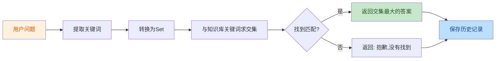

# AI基础问答系统

🤖 基于人工智能基础知识的智能问答系统

## 🌐 在线访问

**立即体验**: https://aiappsystem-ht8hms9j46mdeupqnqnphq.streamlit.app/

任何人都可以通过以上链接访问本系统，无需安装任何软件！

---

## 📖 项目简介

AI基础问答系统是一个基于关键词匹配的智能问答应用，收录了20条人工智能核心基础知识，涵盖机器学习、深度学习、自然语言处理、计算机视觉等热门AI主题。

系统采用简洁的Web界面，用户可以随时提问，获取专业的AI知识解答。

---

## ✨ 核心功能

| 功能 | 说明 |
|-----|------|
| 💬 智能问答 | 输入问题，快速匹配最相关的AI知识 |
| 📚 知识库 | 包含20条人工智能基础知识 |
| 🕐 历史记录 | 自动保存问答历史，永久保留 |
| 🎨 简洁界面 | 清新简洁的Web界面，操作直观 |

---

## 🎯 知识库涵盖主题

系统知识库包含以下AI核心概念：

1. **人工智能基础** - 人工智能定义、机器学习、深度学习
2. **神经网络** - 神经网络、CNN、RNN、Transformer
3. **机器学习类型** - 监督学习、无监督学习、强化学习
4. **NLP与CV** - 自然语言处理、计算机视觉
5. **模型优化** - 过拟合、欠拟合、特征工程、梯度下降
6. **前沿技术** - 大语言模型(LLM)、知识图谱

---

## 🛠️ 技术栈

| 技术 | 说明 |
|-----|------|
| **Python 3.11** | 编程语言 |
| **Streamlit** | Web应用框架 |
| **JSON** | 历史记录持久化 |
| **关键词匹配算法** | 自研匹配引擎 |

---

## 📁 项目结构

```
AI_QA_System/
├── app.py              # Web应用主程序 (Streamlit)
├── knowledge.py         # 知识库模块 (20条AI知识)
├── matcher.py          # 匹配引擎模块 (关键词匹配算法)
├── history.py          # 历史记录模块 (持久化存储)
├── requirements.txt    # 项目依赖清单
├── README.md          # 项目说明文档
├── history.json        # 历史记录数据文件 (自动生成)
└── rules/             # 开发规则目录
    └── project_rules.md
```

---

## 🚀 快速开始

### 本地运行

```bash
# 1. 克隆项目
git clone https://github.com/Tia-Han/AI_QA_System.git
cd AI_QA_System

# 2. 安装依赖
pip install -r requirements.txt

# 3. 启动应用
streamlit run app.py

# 4. 访问
打开浏览器访问: http://localhost:8501
```

### 在线访问

直接访问: https://aiappsystem-ht8hms9j46mdeupqnqnphq.streamlit.app/

---

## 📝 使用指南

### 基本操作

1. **提问**: 在输入框输入问题
2. **查询**: 点击"🔍 查询"按钮
3. **查看答案**: 系统自动匹配并显示答案
4. **查看历史**: 所有问答记录自动保存

### 示例问题

推荐测试的问题：

```
✅ 什么是人工智能？
✅ 什么是机器学习？
✅ 什么是深度学习？
✅ 什么是NLP？
✅ 什么是大语言模型？
✅ 什么是Transformer？
✅ CNN和RNN有什么区别？
```

---

## 🔧 关键修改记录

### 版本 1.1.0 - 历史记录持久化 (2026-06-27)

**修改内容**:
- 实现了历史记录的JSON文件持久化
- 添加了 `_load_history()` 函数，程序启动时自动加载历史
- 添加了 `_save_history()` 函数，每次操作后自动保存
- 修改了 `add_history()` 和 `clear_history()` 函数，增加自动保存逻辑
- 更新了 `.gitignore`，排除 `history.json` 文件

**解决的问题**:
- ❌ 问题: 每次重启应用，历史记录会被清空
- ✅ 解决: 使用JSON文件持久化，重启后自动加载

**相关文件**:
- [history.py](https://github.com/Tia-Han/AI_QA_System/blob/main/history.py)
- [.gitignore](https://github.com/Tia-Han/AI_QA_System/blob/main/.gitignore)

### 版本 1.0.0 - 初始版本 (2026-06-27)

**功能模块**:
- ✅ `app.py` - Streamlit Web应用界面
- ✅ `knowledge.py` - 包含20条AI基础知识
- ✅ `matcher.py` - 关键词匹配算法
- ✅ `history.py` - 历史记录管理（内存版）
- ✅ GitHub仓库初始化和推送

**部署信息**:
- 部署平台: Streamlit Community Cloud
- 访问链接: https://aiappsystem-ht8hms9j46mdeupqnqnphq.streamlit.app/

---

## 🎨 系统界面预览

```
┌─────────────────────────────────────────────┐
│          🤖 AI基础问答系统                   │
├─────────────────────────────────────────────┤
│                                             │
│  📝 提问区域                                │
│  ┌─────────────────────────────────┐       │
│  │ 请输入您的问题:                   │       │
│  └─────────────────────────────────┘       │
│  [🔍 查询]                                 │
│                                             │
├─────────────────────────────────────────────┤
│                                             │
│  💬 回答区域                                │
│  (显示匹配的答案)                          │
│                                             │
├─────────────────────────────────────────────┤
│                                             │
│  📚 历史记录                                │
│  历史记录总数: N                            │
│  [🗑️ 清空历史记录]                          │
│                                             │
└─────────────────────────────────────────────┘
```

---

## 🔄 自动更新机制

本项目支持代码更新后自动重新部署：

1. 修改本地代码
2. 推送到 GitHub 仓库
3. Streamlit Cloud 自动检测到更新
4. 自动拉取最新代码并重新部署
5. 约2-5分钟后，最新版本生效

**推送命令**:
```bash
git add .
git commit -m "更新说明"
git push
```

---

## 📊 匹配算法说明

系统采用关键词匹配算法：



**算法特点**:
- 快速响应，无需GPU
- 基于精确关键词匹配
- 优先返回关键词重叠最多的答案

---

## 🤝 参与贡献

欢迎提出建议和改进意见！

1. Fork 本仓库
2. 创建新分支 (`git checkout -b feature/AmazingFeature`)
3. 提交更改 (`git commit -m 'Add some AmazingFeature'`)
4. 推送到分支 (`git push origin feature/AmazingFeature`)
5. 创建 Pull Request

---

## 📄 许可证

本项目采用 MIT 许可证

---

## 👨‍💻 作者

**GitHub**: https://github.com/Tia-Han

**项目地址**: https://github.com/Tia-Han/AI_QA_System

**在线演示**: https://aiappsystem-ht8hms9j46mdeupqnqnphq.streamlit.app/

---

## 🙏 致谢

- [Streamlit](https://streamlit.io/) - 优秀的Python Web框架
- [Streamlit Community Cloud](https://streamlit.io/cloud) - 免费云部署平台
- 所有测试和使用本系统的用户

---

**最后更新**: 2026-06-27
